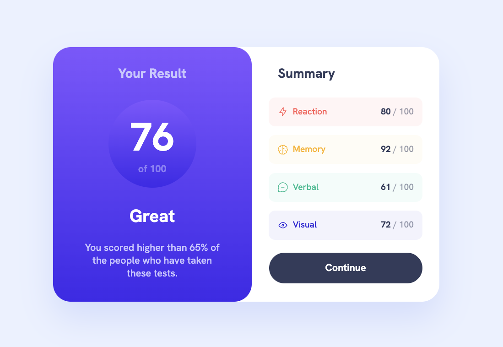
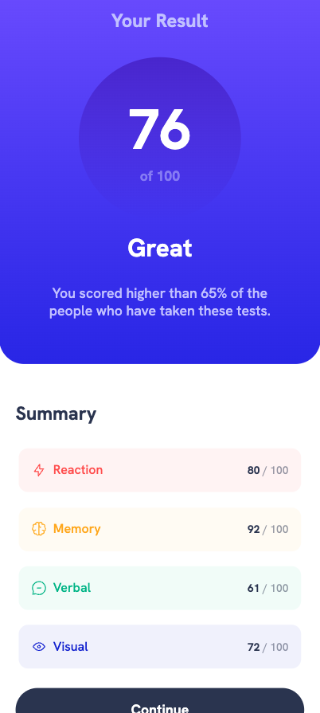

# Frontend Mentor - Results summary component solution

This is a solution to the [Results summary component challenge on Frontend Mentor](https://www.frontendmentor.io/challenges/results-summary-component-CE_K6s0maV). Frontend Mentor challenges help you improve your coding skills by building realistic projects. 

## Table of contents

- [Overview](#overview)
  - [The challenge](#the-challenge)
  - [Screenshot](#screenshot)
  - [Links](#links)
- [My process](#my-process)
  - [Built with](#built-with)
  - [What I learned](#what-i-learned)
  - [Continued development](#continued-development)
  - [AI Collaboration](#ai-collaboration)
- [Author](#author)

## Overview

### The challenge

Users should be able to:

- View the optimal layout for the interface depending on their device's screen size
- See hover and focus states for all interactive elements on the page

### Screenshot
| Desktop | Mobile |
|---------|--------|
|  |  |

### Links

- [Solution URL](https://github.com/vikiluk/results-summary-component)
- [Live Site URL](https://vikiluk.github.io/results-summary-component/)

## My process

### Built with

- HTML
- CSS
- CSS linear-gradient
- CSS media queries
- Local font files

### What I learned
- I learned how to use `linear-gradient`
- I learned how to use `@font-face` to load local font files
- I learned how to use `:hover` pseudo-class for interactive states
- I learned how to use multiple classes on elements

### Continued development

I want to continue practicing HTML and CSS by working through more Frontend Mentor challenges. I'd like to get more comfortable using different fonts and transitions.

### AI Collaboration

I used Claude (Claude Code) as a guided mentor throughout this project. Claude walked me through each step — from structuring the HTML, writing CSS properties, using @media for adjusting content to be responsive for smaller devices to reading values from Figma. Rather than giving me the answers directly, Claude asked questions and gave hints to help me figure things out myself.

## Author

- GitHub - [vikiluk](https://github.com/vikiluk)
- Frontend Mentor - [@vikiluk](https://www.frontendmentor.io/profile/vikiluk)
- [LinkedIn](https://www.linkedin.com/in/viktória-lukáčová-960a51253/)